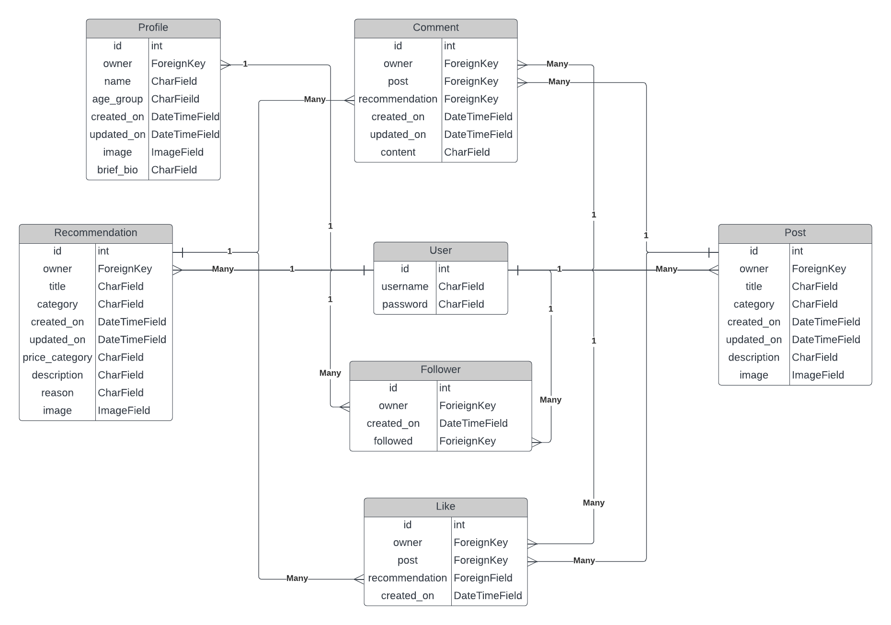

# BE INSPIRED - DRF API

## Table of Contents

- [Design](<#design>)
	- [User Stories](<#user-stories>)
	- [Database Schema](<#database-schema>)
        - [User](<#user>)
	    - [Profile](<#profile>)
        - [Followers](<#followers>)
	    - [Post](<#post>)
        - [Recommendation](<#recommendation>)
	    - [Like](<#like>)
	    - [Comment](<#comment>)
- [Testing](<#testing>)
	- [Manual Testing](<#manual-testing>)
	- [Validation](<#validation>)
- [Technologies](<#technologies>)
	- [Development Technologies](<#development-technologies>)
	- [Testing Technologies](<#testing-technologies>)
- [Deployment](<#deployment>)
	- [Django](<#django>)
	    - [Project Setup](<#project-setup>)
	    - [JWT Tokens](<#jwt-tokens>)
        - [Heroku Deployment](<#heroku-deployment>)
	- [Heroku](<#heroku>)
- [Credits and Resources](<#credits-and-resources>)
	- [Code](<#code>)

## Design
### User Stories
The API was designed using the back end to achieve the user stories mentioned in the front end of 'Be Inspired' project. The back-end focuses on its administration side and can be described as one user story:

As an admin, I want to be able to create, edit and delete the users, posts, comments and likes, so that I can have full control the application using its CRUD features.

### Database Schema
The database was built using the Django Rest Framework. It makes use of Django models, serializers, and views. The Data Schema was designed as shown below:

#### User Model

- The User model consists of information about the user and is a part of Django allauth library. 
- Relationships of User entity with other entities
	- One-to-one relation with the Profile entity owner field
	- One-to-many ForeignKey relation with the Follower entity owner and followed fields
	- One-to-many ForeignKey relation with the Post entity owner field
	- One-to-many ForeignKey relation with the Recommendation entity owner field
	- One-to-many ForeignKey relation with the Comment entity owner field
	- One-to-many ForeignKey relation with the Like entity owner field

#### Profile Model

- The Profile entity contains the following keys: owner, name, age_group, brief_bio, created_on, updated_on and image
- One-to-one relation between the owner field and the user entity id field

The Profile model serializer adds additional fields when a model instance that is returned by the API:
- is_owner: Whether the user making the request is the owner

Django generics API views were used for Profile model:
- ListAPIView enables:
	- Users to retrieve a list of Profiles
- RetrieveUpdateAPIView enables:
	- Users to obtain a single Profile instance
	- Users to update a single Profile instance (if it is theirs)

Then generate a view to render in 'views.py' file and create and wire up 'urls.py' in the respective directory. Then in 'urls.py' of project directory, for Class-based views
- Add a URL to urlpatterns:  path('', Home.as_view(), name='home')

#### Post Model
- The Post entity contains the fields: owner, title, category, description, created_on, updated_on and image
- Relationships of Post entity with other entities
	- One-to-many ForeignKey relation with the Comment entity owner field
	- One-to-many ForeignKey relation with the Like entity owner field

The Post model serializer adds additional fields for when a model instance that is returned by the API:
- is_owner: Whether the user making the request is the owner
- profile_id: The profile id of the user that created the post
- profile_image: The profile image of the user that made the post

Django generics API views were used for Post model:
- ListAPIView enables:
	- Users to retrieve a list of posts
- RetrieveUpdateAPIView enables:
	- Users to obtain a single Post instance
	- Users to update a single Post instance (if they own it)

#### Recommedation Model
- The Recommedation entity contains the fields: owner, title, category, description, created_on, updated_on and image
- Relationships of Recommedation entity with other entities
	- One-to-many ForeignKey relation with the Comment entity owner field
	- One-to-many ForeignKey relation with the Like entity owner field

The Recommedation model serializer adds additional fields for when a model instance that is returned by the API:
- is_owner: Whether the user making the request is the owner
- profile_id: The profile id of the user that created the Recommedation
- profile_image: The profile image of the user that made the Recommedation

Django generics API views were used for Recommedation model:
- ListAPIView enables:
	- Users to retrieve a list of recommedations
- RetrieveUpdateAPIView enables:
	- Users to obtain a single Recommedation instance
	- Users to update a single Recommedation instance (if they own it)

## Project Setup
Django Rest Framework (DRF) was used to create this API. DRF project was set up and many necessary dependencies were installed following these steps:

1. Within your development environment/terminal, install Django with: `pip3 install django>4` to install Django framework.
2. The code at terminal `pip3 install <package>` was used to install different dependencies:
- `pip3 install django-cloudinary-storage`- for Cloudinary to store uploaded image files
- `pip3 install Pillow` - To allow ImageFields to be used in the database models
- `pip3 install djangorestframework`- To install Django Rest Framework

3. Once these dependencies are installed, requirements.txt is updated using: `pip3 freeze > requirements.txt`. 
4. New Django project using the command `django-admin startproject <your-project-name> .` (dot at the end is necessary create it in root directory).
5. Add your installed apps to the `settings.py` file INSTALLED_APPS variable. The required lines are:
~~~
'cloudinary_storage',
'cloudinary',
'rest_framework',

~~~
6. To configure cloudinary, the following variables need to be set in settings.py: 
- `CLOUDINARY_STORAGE`: this should be set to your own cloudinary URL. Create env.py file in root directory and create a`CLOUDINARY_URL` environment variable in an env.py file like this
~~~
import os

os.environ['CLOUDINARY_URL'] = 'cloudinary:<url from personal cloudinary account>
~~~

and import this into the settings.py file using:
~~~
import os
if os.path.exists('env'):
    import env
~~~
 
`CLOUDINARY_STORAGE` is to be set to: `{'CLOUDINARY_URL': os.environ.get('CLOUDINARY_URL')}` which retrieves the env.py variable in a development environment, but also allows a Config Var to be set in Heroku for later deployment to Heroku.

- `MEDIA_URL`: this is set to '/media/' in this project
- `DEFAULT_FILE_STORAGE`: is to be set to 'cloudinary_storage.storage.MediaCloudinaryStorage'

7. . Whilst in the `env.py` file, create a `SECRET_KEY` variable which will be used later for Heroku deployment. To generate a new Django secret key, do a google search for a random key generator and use one of the results to create a key. The variable can be created using: 
~~~
os.environ ["SECRET_KEY"] = "<copy and paste the secret key>"
~~~
Back in settings.py, find the `SECRET_KEY` variable and replace the assignment as follows:
~~~
SECRET_KEY = os.environ.get('SECRET_KEY')
~~~

~~~
git add .
git commit -m "initial commit"
git push
~~~

- App Creation
After creation of new App using `python3 manage.py startapp <app>`, it must be added to installed apps in settings.py.

Once the database models are created in 'models.py' file, they must be registered in 'admin.py' file of the respective app directory. Later the migrations must be made to the database.

